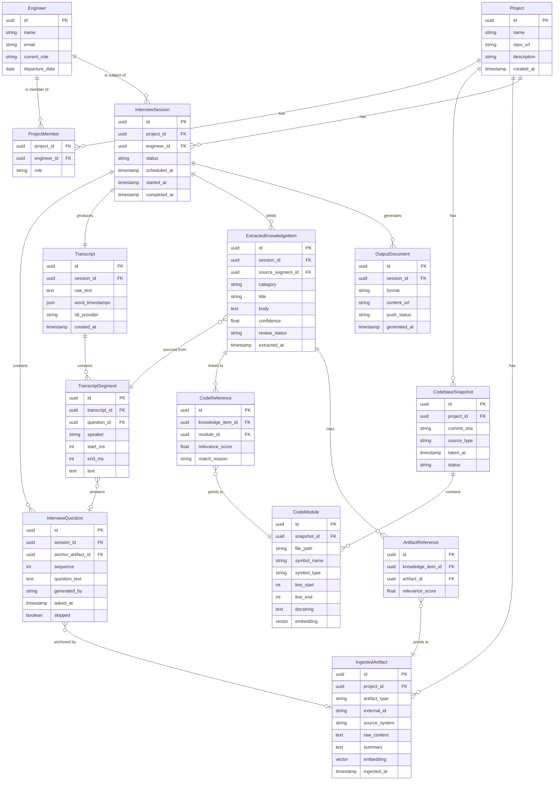

# Data Model — Entity Relationship Diagram

---

## Key Design Decisions

**`artifact_type` values on `IngestedArtifact`:** `commit`, `pull_request`, `ticket`, `doc_page`, `readme`, `manual_paste`

**`symbol_type` values on `CodeModule`:** `file`, `function`, `class`, `method`, `export`, `route`

**`category` values on `ExtractedKnowledgeItem`:**
- `decision` — an architectural or implementation choice and its rationale
- `gotcha` — something non-obvious that will bite the next engineer
- `risk` — known fragility, tech debt, or dependency concern
- `pattern` — a recurring pattern used in this codebase
- `context` — background that doesn't fit other categories

**`source_type` values on `CodebaseSnapshot`:** `zip_upload` (v1), `github_api` (v2), `git_clone` (v2)

**`review_status` on `ExtractedKnowledgeItem`:** `pending`, `accepted`, `rejected`, `edited` — supports the v2 reviewer workflow; default `accepted` in v1.

**Embeddings:** `CodeModule.embedding` and `IngestedArtifact.embedding` are stored as `vector(1536)` (pgvector) or omitted and stored in an external vector store in v1.
