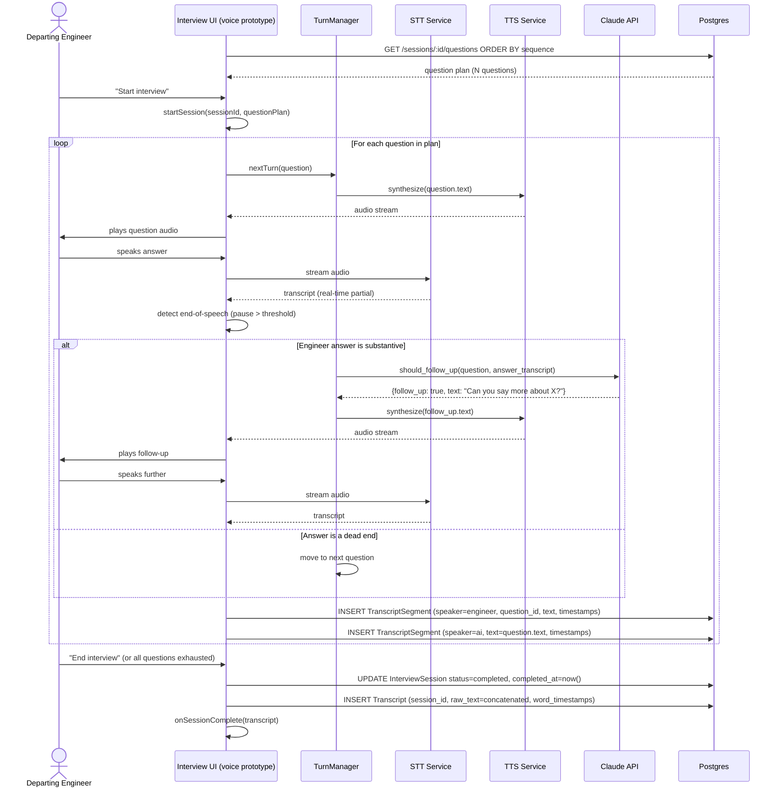
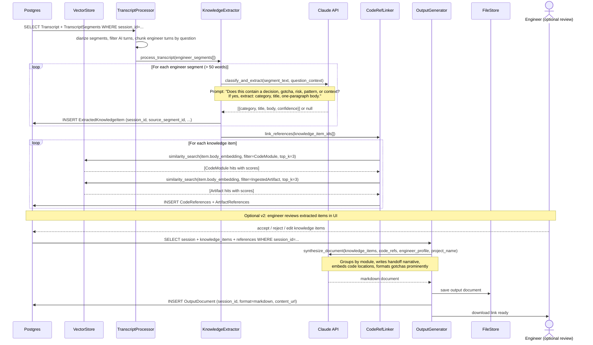

# Sequence Diagram — Live Interview + Post-Processing

## Part A: Live Interview

```mermaid
sequenceDiagram
    actor Eng as Departing Engineer
    participant UI as Interview UI (voice prototype)
    participant TM as TurnManager
    participant STT as STT Service
    participant TTS as TTS Service
    participant LLM as Claude API
    participant DB as Postgres

    UI->>DB: GET /sessions/:id/questions ORDER BY sequence
    DB-->>UI: question plan (N questions)

    Eng->>UI: "Start interview"
    UI->>UI: startSession(sessionId, questionPlan)

    loop For each question in plan
        UI->>TM: nextTurn(question)
        TM->>TTS: synthesize(question.text)
        TTS-->>UI: audio stream
        UI->>Eng: plays question audio

        Eng->>UI: speaks answer
        UI->>STT: stream audio
        STT-->>UI: transcript (real-time partial)

        UI->>UI: detect end-of-speech (pause > threshold)

        alt Engineer answer is substantive
            TM->>LLM: should_follow_up(question, answer_transcript)
            LLM-->>TM: {follow_up: true, text: "Can you say more about X?"}
            TM->>TTS: synthesize(follow_up.text)
            TTS-->>UI: audio stream
            UI->>Eng: plays follow-up
            Eng->>UI: speaks further
            UI->>STT: stream audio
            STT-->>UI: transcript
        else Answer is a dead end
            TM->>TM: move to next question
        end

        UI->>DB: INSERT TranscriptSegment (speaker=engineer, question_id, text, timestamps)
        UI->>DB: INSERT TranscriptSegment (speaker=ai, text=question.text, timestamps)
    end

    Eng->>UI: "End interview" (or all questions exhausted)
    UI->>DB: UPDATE InterviewSession status=completed, completed_at=now()
    UI->>DB: INSERT Transcript (session_id, raw_text=concatenated, word_timestamps)
    UI->>UI: onSessionComplete(transcript)
```

---

## Part B: Post-Interview Processing

```mermaid
sequenceDiagram
    participant DB as Postgres
    participant VS as VectorStore
    participant TP as TranscriptProcessor
    participant KE as KnowledgeExtractor
    participant LLM as Claude API
    participant CRL as CodeRefLinker
    participant OG as OutputGenerator
    participant FS as FileStore
    actor Eng as Engineer (optional review)

    DB->>TP: SELECT Transcript + TranscriptSegments WHERE session_id=...
    TP->>TP: diarize segments, filter AI turns, chunk engineer turns by question

    TP->>KE: process_transcript(engineer_segments[])

    loop For each engineer segment (> 50 words)
        KE->>LLM: classify_and_extract(segment_text, question_context)
        Note over KE,LLM: Prompt: "Does this contain a decision, gotcha, risk, pattern, or context?<br/>If yes, extract: category, title, one-paragraph body."
        LLM-->>KE: [{category, title, body, confidence}] or null
        KE->>DB: INSERT ExtractedKnowledgeItem (session_id, source_segment_id, ...)
    end

    KE->>CRL: link_references(knowledge_item_ids[])

    loop For each knowledge item
        CRL->>VS: similarity_search(item.body_embedding, filter=CodeModule, top_k=3)
        VS-->>CRL: [CodeModule hits with scores]
        CRL->>VS: similarity_search(item.body_embedding, filter=IngestedArtifact, top_k=3)
        VS-->>CRL: [Artifact hits with scores]
        CRL->>DB: INSERT CodeReferences + ArtifactReferences
    end

    Note over DB,Eng: Optional v2: engineer reviews extracted items in UI
    Eng-->>DB: accept / reject / edit knowledge items

    DB->>OG: SELECT session + knowledge_items + references WHERE session_id=...
    OG->>LLM: synthesize_document(knowledge_items, code_refs, engineer_profile, project_name)
    Note over OG,LLM: Groups by module, writes handoff narrative,<br/>embeds code locations, formats gotchas prominently
    LLM-->>OG: markdown document

    OG->>FS: save output document
    OG->>DB: INSERT OutputDocument (session_id, format=markdown, content_url)
    OG->>Eng: download link ready
```
