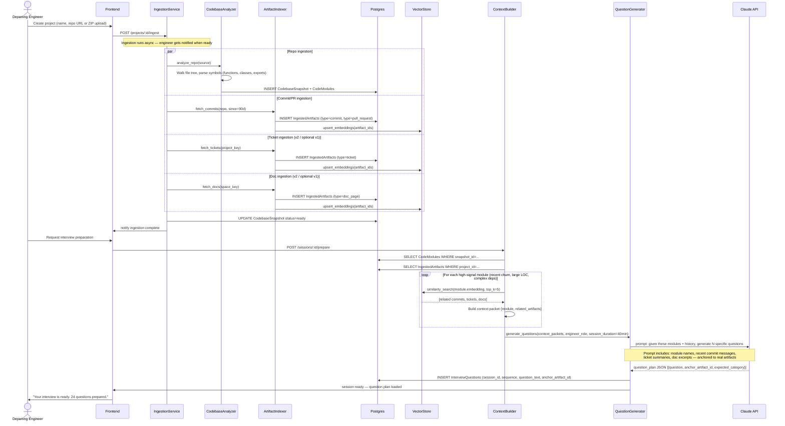

# Sequence Diagram — Pre-Interview: Ingestion → Question Generation

```mermaid
sequenceDiagram
    actor Eng as Departing Engineer
    participant FE as Frontend
    participant IS as IngestionService
    participant CA as CodebaseAnalyzer
    participant AI as ArtifactIndexer
    participant DB as Postgres
    participant VS as VectorStore
    participant CB as ContextBuilder
    participant QG as QuestionGenerator
    participant LLM as Claude API

    Eng->>FE: Create project (name, repo URL or ZIP upload)
    FE->>IS: POST /projects/:id/ingest

    Note over IS: Ingestion runs async — engineer gets notified when ready

    par Repo ingestion
        IS->>CA: analyze_repo(source)
        CA->>CA: Walk file tree, parse symbols (functions, classes, exports)
        CA->>DB: INSERT CodebaseSnapshot + CodeModules
    and Commit/PR ingestion
        IS->>AI: fetch_commits(repo, since=90d)
        AI->>DB: INSERT IngestedArtifacts (type=commit, type=pull_request)
        AI->>VS: upsert_embeddings(artifact_ids)
    and Ticket ingestion (v2 / optional v1)
        IS->>AI: fetch_tickets(project_key)
        AI->>DB: INSERT IngestedArtifacts (type=ticket)
        AI->>VS: upsert_embeddings(artifact_ids)
    and Doc ingestion (v2 / optional v1)
        IS->>AI: fetch_docs(space_key)
        AI->>DB: INSERT IngestedArtifacts (type=doc_page)
        AI->>VS: upsert_embeddings(artifact_ids)
    end

    IS->>DB: UPDATE CodebaseSnapshot status=ready
    IS->>FE: notify ingestion complete

    Eng->>FE: Request interview preparation
    FE->>CB: POST /sessions/:id/prepare

    CB->>DB: SELECT CodeModules WHERE snapshot_id=...
    CB->>DB: SELECT IngestedArtifacts WHERE project_id=...

    loop For each high-signal module (recent churn, large LOC, complex deps)
        CB->>VS: similarity_search(module.embedding, top_k=5)
        VS-->>CB: [related commits, tickets, docs]
        CB->>CB: Build context packet {module, related_artifacts}
    end

    CB->>QG: generate_questions(context_packets, engineer_role, session_duration=40min)

    QG->>LLM: prompt: given these modules + history, generate N specific questions
    Note over QG,LLM: Prompt includes: module names, recent commit messages,<br/>ticket summaries, doc excerpts — anchored to real artifacts

    LLM-->>QG: question_plan JSON [{question, anchor_artifact_id, expected_category}]

    QG->>DB: INSERT InterviewQuestions (session_id, sequence, question_text, anchor_artifact_id)

    QG->>FE: session ready — question plan loaded
    FE->>Eng: "Your interview is ready. 24 questions prepared."
```
