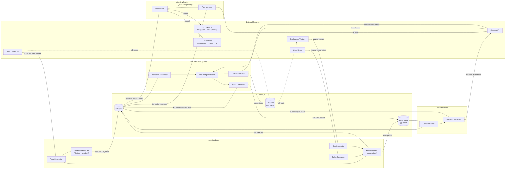
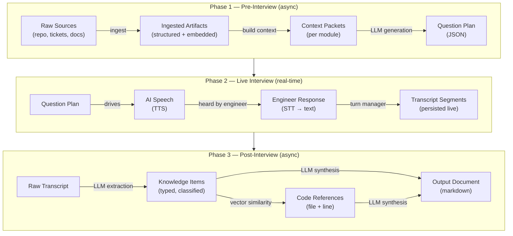

# System Architecture — Component Overview

Two focused views: the full component map, then the data-flow overlay.

---

## View 1: Component Map

```mermaid
flowchart LR
    subgraph ext["External Systems"]
        GH["GitHub / GitLab"]
        JR["Jira / Linear"]
        CF["Confluence / Notion"]
        CLAUDE["Claude API"]
        STT_SVC["STT Service\n(Deepgram / Web Speech)"]
        TTS_SVC["TTS Service\n(ElevenLabs / OpenAI TTS)"]
    end

    subgraph ingest["Ingestion Layer"]
        RC["Repo Connector"]
        TC["Ticket Connector"]
        DC["Doc Connector"]
        CA["Codebase Analyzer\n(file tree + symbols)"]
        AI_IDX["Artifact Indexer\n(embeddings)"]
    end

    subgraph store["Storage"]
        DB[("Postgres")]
        VS[("Vector Store\n(pgvector)")]
        FS[("File Store\n(S3 / local)")]
    end

    subgraph ctx["Context Pipeline"]
        CB["Context Builder"]
        QG["Question Generator"]
    end

    subgraph iv["Interview Engine\n← your voice prototype"]
        UI["Interview UI"]
        TM["Turn Manager"]
    end

    subgraph post["Post-Interview Pipeline"]
        TP["Transcript Processor"]
        KE["Knowledge Extractor"]
        CRL["Code Ref Linker"]
        OG["Output Generator"]
    end

    GH -->|commits, PRs, file tree| RC
    JR -->|issues, epics, labels| TC
    CF -->|pages, spaces| DC

    RC --> CA & AI_IDX
    TC --> AI_IDX
    DC --> AI_IDX

    CA -->|modules + symbols| DB
    AI_IDX -->|raw artifacts| DB
    AI_IDX -->|embeddings| VS

    DB & VS --> CB
    CB --> QG
    QG <-->|question generation| CLAUDE
    QG -->|question plan JSON| DB

    DB -->|question plan + context| UI
    UI <-->|audio| STT_SVC
    UI <-->|speech| TTS_SVC
    UI --- TM
    TM <-->|AI turns| CLAUDE
    TM -->|transcript segments| DB

    DB --> TP
    TP --> KE
    KE <-->|classification| CLAUDE
    KE --> CRL
    CRL -->|semantic lookup| VS
    CRL -->|knowledge items + refs| DB
    KE --> OG
    OG <-->|document synthesis| CLAUDE
    OG -->|output docs| FS

    FS -.->|"v2: push"| GH
    FS -.->|"v2: push"| CF
```

---

## View 2: Data Flow by Phase

```mermaid
flowchart TB
    subgraph phase1["Phase 1 — Pre-Interview (async)"]
        direction LR
        P1A["Raw Sources\n(repo, tickets, docs)"]
        P1B["Ingested Artifacts\n(structured + embedded)"]
        P1C["Context Packets\n(per module)"]
        P1D["Question Plan\n(JSON)"]
        P1A -->|ingest| P1B
        P1B -->|build context| P1C
        P1C -->|LLM generation| P1D
    end

    subgraph phase2["Phase 2 — Live Interview (real-time)"]
        direction LR
        P2A["Question Plan"]
        P2B["AI Speech\n(TTS)"]
        P2C["Engineer Response\n(STT → text)"]
        P2D["Transcript Segments\n(persisted live)"]
        P2A -->|drives| P2B
        P2B -->|heard by engineer| P2C
        P2C -->|turn manager| P2D
    end

    subgraph phase3["Phase 3 — Post-Interview (async)"]
        direction LR
        P3A["Raw Transcript"]
        P3B["Knowledge Items\n(typed, classified)"]
        P3C["Code References\n(file + line)"]
        P3D["Output Document\n(markdown)"]
        P3A -->|LLM extraction| P3B
        P3B -->|vector similarity| P3C
        P3B & P3C -->|LLM synthesis| P3D
    end

    phase1 --> phase2
    phase2 --> phase3
```
